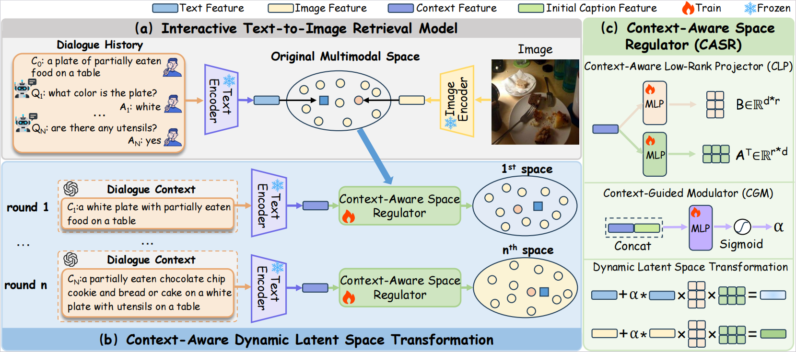

# CAST: Context-Aware Dynamic Latent Space Transformation for Interactive Text-to-Image Retrieval


## News

- **2026.02** 🎉 CAST has been accepted to **CVPR 2026**!
- **2026.08** 🚀 Training and evaluation code released.

---

## Overview

Interactive text-to-image retrieval progressively refines retrieval results through multi-turn interactions with users. CAST introduces a **Context-Aware Dynamic Latent Space Transformation** mechanism that dynamically adapts the retrieval space according to the evolving interaction context.

<p align="center">
  
</p>

---

## Datasets

Please download the following datasets from their respective official websites:

- [**COCO 2017 Unlabeled Images**](https://cocodataset.org/#download)
- [**VisDial v1.0**](https://visualdialog.org/)

Organize the VisDial dataset as follows:

```text
VisDial/
├── train/
│   ├── images/
│   └── visdial_1.0_train.json
└── val/
    ├── images/
    └── visdial_1.0_val.json
```

### Reconstruct Dialogue Captions

After preparing the datasets, run the following script to generate the reconstructed dialogue captions:

```bash
python recon_dialog.py --split train --run_idx 0
```

The generated reconstructed captions should be stored in the `dial_recon/` directory and will be used during subsequent training and evaluation.

---

## Environment

Our experiments are conducted with the following environment:

- **Ubuntu:** 20.04
- **CUDA:** 12.6
- **Python:** 3.10

Create the corresponding Conda environment:

```bash
conda create -n CAST python=3.10 -y
conda activate CAST
pip install -r requirements.txt
```

Please also download the required pretrained models, such as **BLIP**, from their official repositories before training or evaluation.

---

## Training

Before training, please make sure that:

1. The datasets have been properly prepared.
2. The reconstructed dialogue captions have been generated using `recon_dialog.py`.
3. The pretrained BLIP checkpoint is available.

Run multi-GPU finetuning on VisDial with:

```bash
./train.sh $temp $recon_path $pretrained
```

### Arguments

| Argument | Description |
|---|---|
| `$temp` | Temperature used in the contrastive loss |
| `$recon_path` | Path to the reconstructed dialogue captions |
| `$pretrained` | Path to the pretrained BLIP checkpoint |

### Example

```bash
./train.sh 0.03 ./dial_recon pretrained/blip_base.pth
```

---

## Evaluation

Run the following script to evaluate CAST using reconstructed dialogue captions:

```bash
./eval.sh $model $cache $data_dir $queries $recon $finetuned_weights
```

### Arguments

| Argument | Description |
|---|---|
| `$model` | Retrieval backbone, e.g., `blip` |
| `$cache` | Path to the cached corpus feature file |
| `$data_dir` | Root directory of the dataset |
| `$queries` | Path to the VisDial query JSON file |
| `$recon` | Path to the reconstructed dialogue captions |
| `$finetuned_weights` | Path to the finetuned CAST checkpoint |

---

## Acknowledgements

## Acknowledgements

We sincerely thank the authors of [ChatIR](https://github.com/levymsn/ChatIR) and [PlugIR](https://github.com/Saehyung-Lee/PlugIR) for making their code publicly available. Our implementation refers to and builds upon parts of their codebases.

We also thank the authors and maintainers of [BLIP](https://github.com/salesforce/BLIP), [VisDial](https://github.com/batra-mlp-lab/visdial), and [COCO](https://cocodataset.org/) for their excellent work and publicly available resources.

---

## Citation

If you find CAST useful for your research, please consider citing our paper:

```bibtex
@inproceedings{lin2026cast,
  title={CAST: Context-Aware Dynamic Latent Space Transformation for Interactive Text-to-Image Retrieval},
  author={Lin, Xuanzuo and Zhang, Min and Liu, Daizong and Zuo, Zhiwen and Yang, Xun and Lin, Changting and Wang, Xun and Dong, Jianfeng},
  booktitle={Proceedings of the IEEE/CVF Conference on Computer Vision and Pattern Recognition},
  pages={38794--38803},
  year={2026}
}
```

---

## License

Please refer to the licenses of the original datasets and pretrained models for their respective terms of use.
